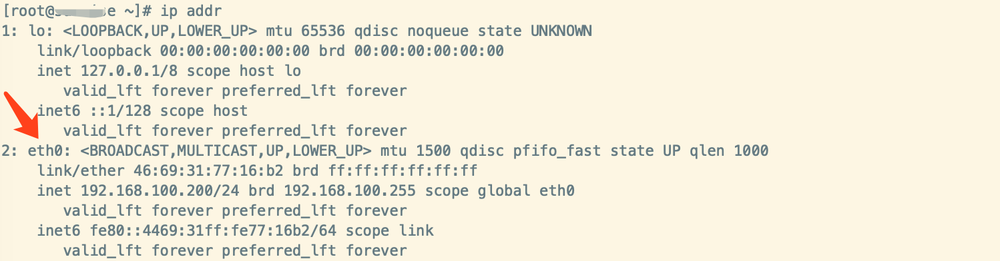
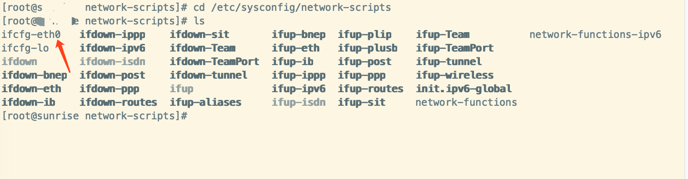
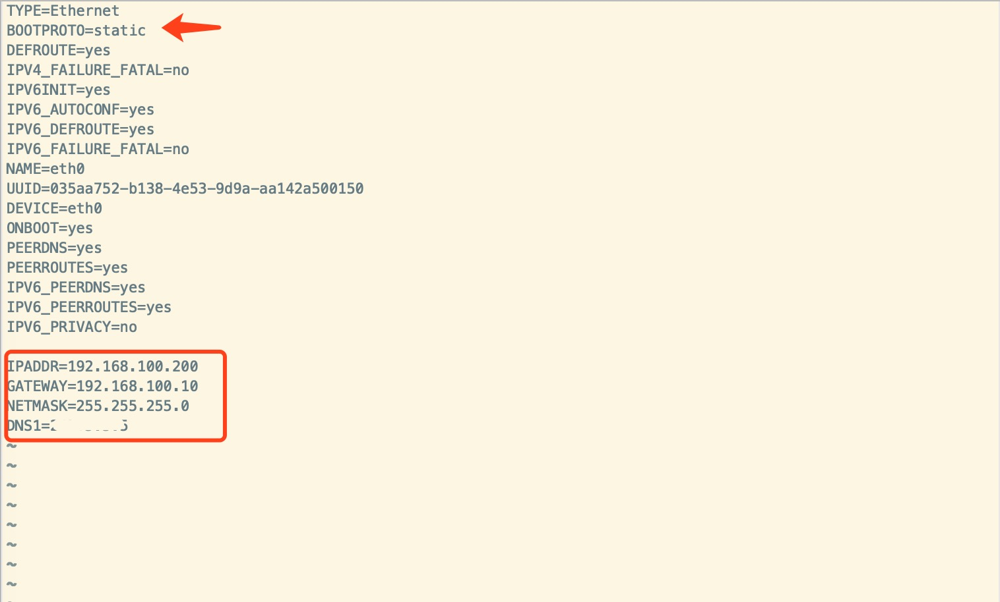
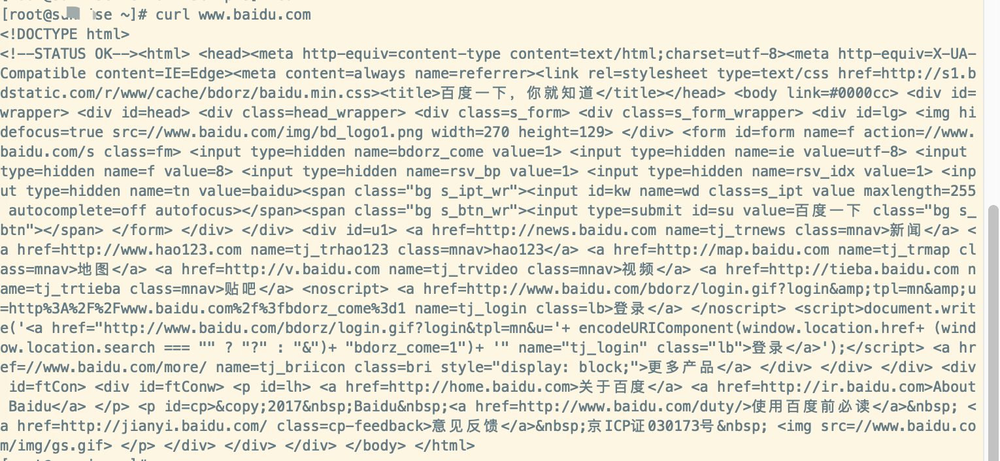
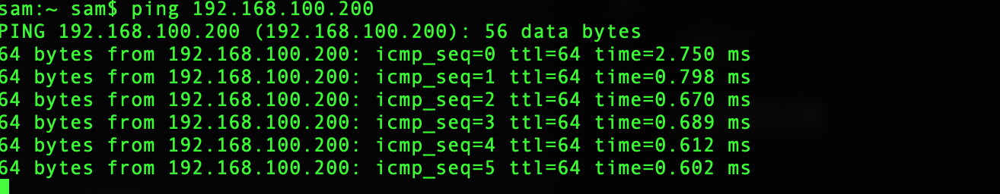
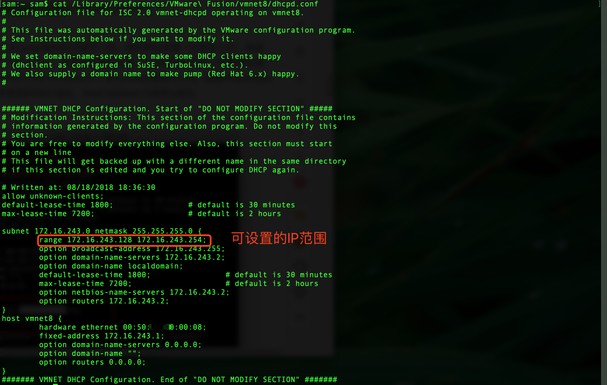

# 设置固定ip

> 详细介绍如何设置centos的固定ip，避免服务器的ip发生变化。

# 查看网络名称

```shell
$ ip addr
```



- eth0就是本地网卡的名称。

# 查看网卡的配置文件

```shell
# 去到网络脚本目录
$ cd /etc/sysconfig/network-scriptes
$ ls
```



# 修改`ifcfg-eth0`网卡文件

```shell
$ vi ifcfg-eth0
```



- BOOTPROTO=static # 启动协议（静态ip）
- ONBOOT=yes # 系统启动时激活网卡
- IPADDR=固定IP
- NETMASK=子网掩码
- GATEWAY=网关
- DNS1=114.114.114.114 #国内填这个就好

保存文件。

# 重启网络

```shell
$ systemctl restart network
```

# 验证网络

## 访问外网

```shell
$ curl www.baidu.com
```



## PING设置好的固定IP

在另外一台机器ping

```shell
$ ping 192.168.100.200
```



> 设置成功啦

# 查看mac虚拟机VMware Fusion可设置的IP范围

```shell
$ cat /Library/Preferences/VMware\ Fusion/vmnet8/dhcpd.conf
```

